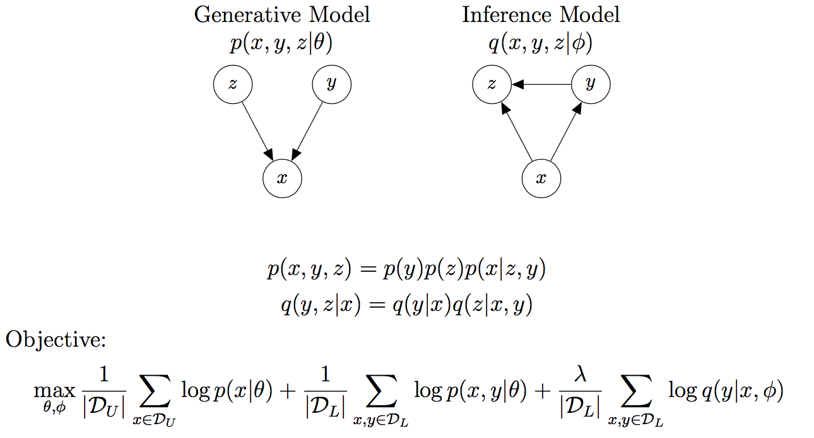
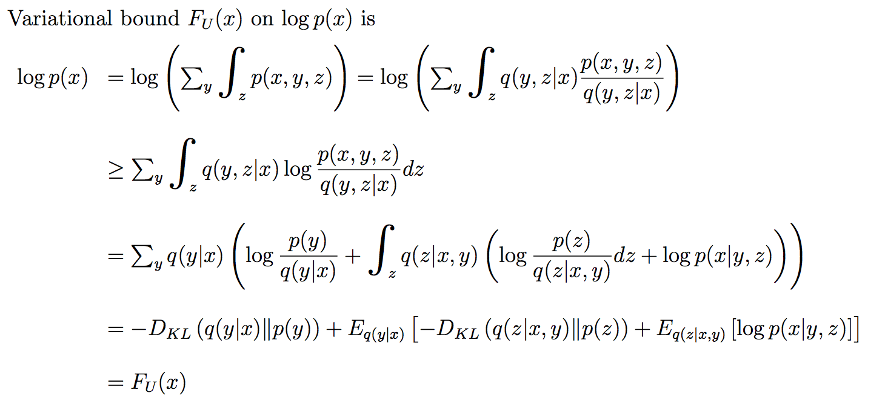
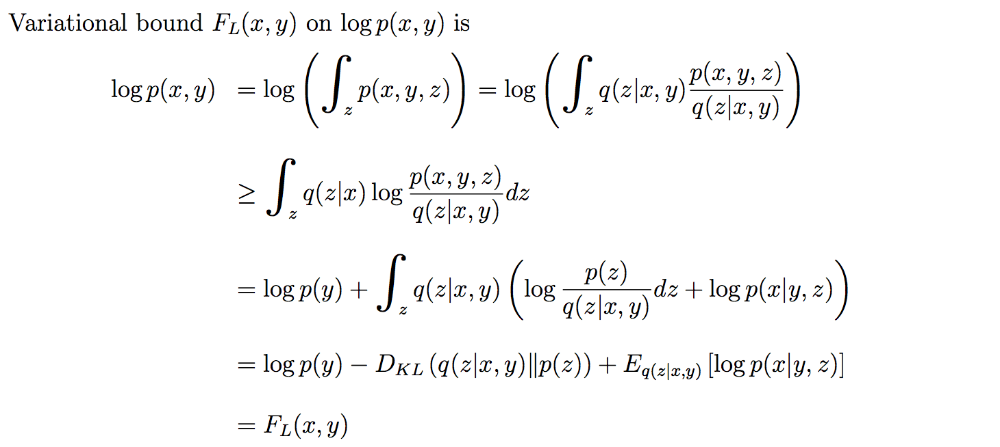
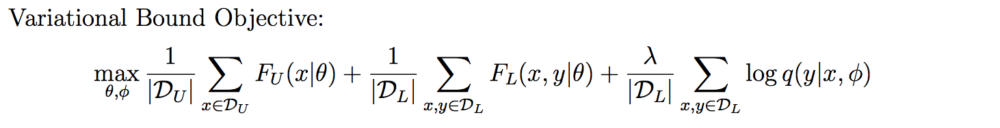

# Models

## Baseline MLP

This is a fully-connected work that shares the same architecture as that of `q(y|x)` in all of the models described below, except the LogisticNormal model, in which q(y|x) is estimated with Monte Carlo sampling.

## Models based on the M2 model in [1]

#### ExactM2

#### ApproxM2

#### GumbelSoftmaxM2

#### LogisticNormalM2

## Another set of models 

#### LogGamma

#### LogisticNormal

